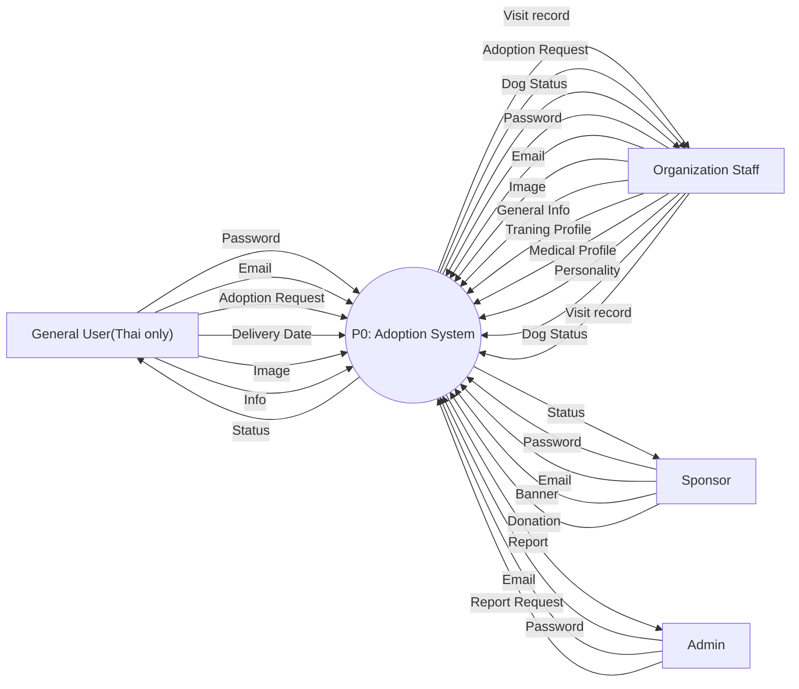
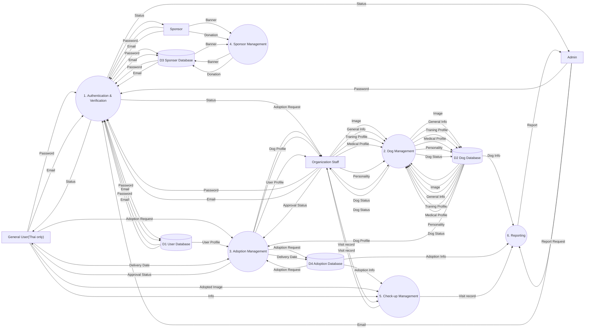
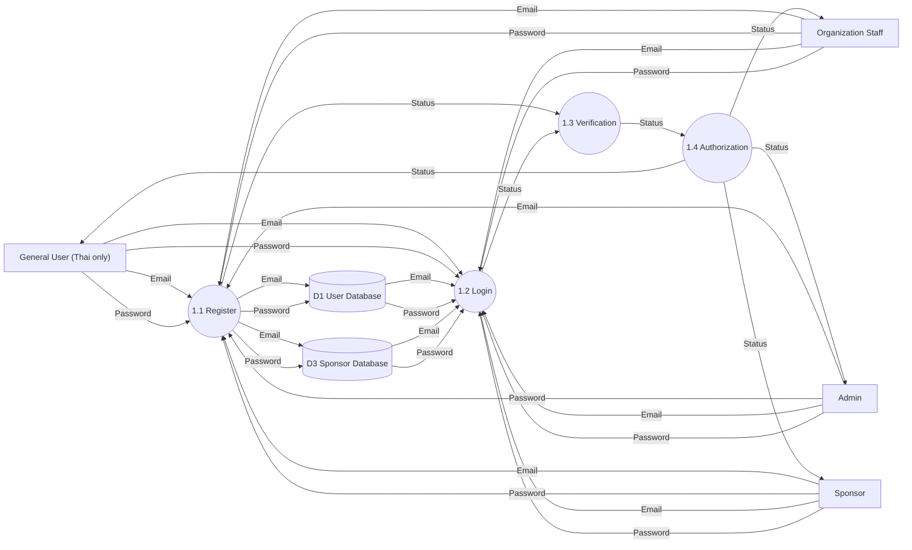
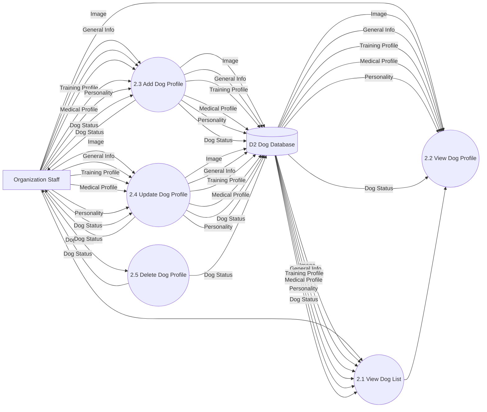
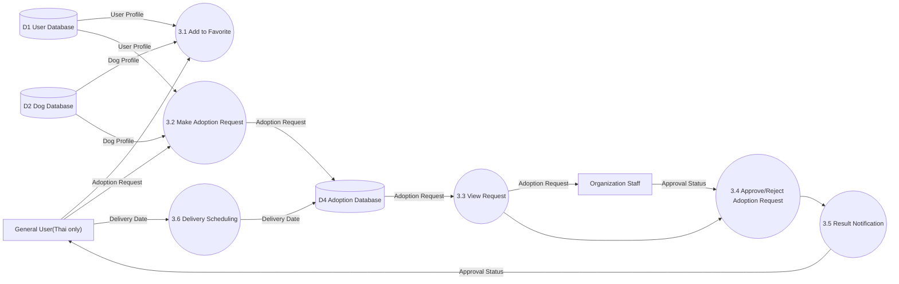
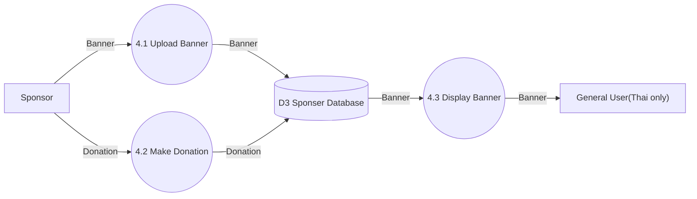
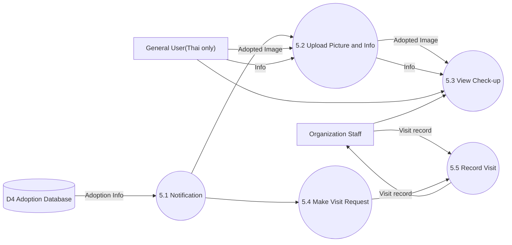
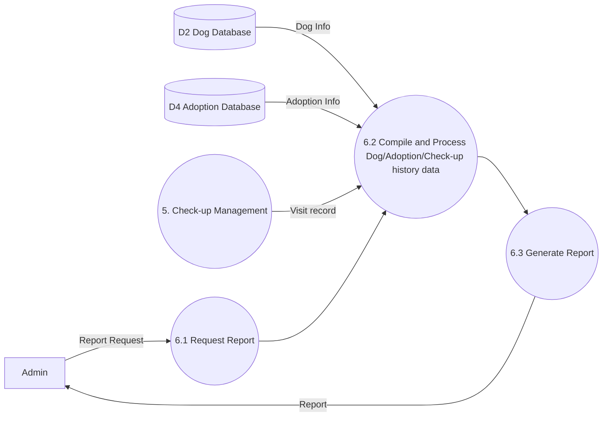
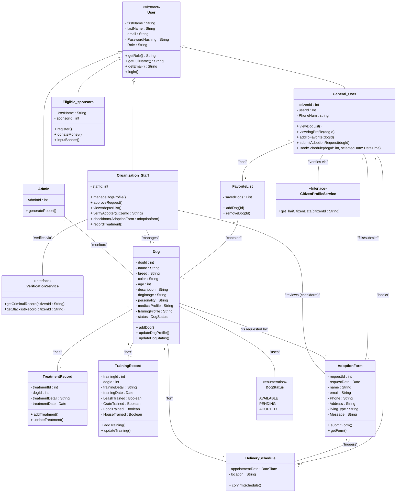

# JITNONGNOONG_D1_Design

## C4 Diagram
### 1. Context Diagram

**Explanation:** The design of this Context Diagram shows the big picture of the Dog Adoption System. It shows which and conceptually how actors and external systems interact with the system.

1. Requirements Alignment: The diagram addresses key stakeholders from the requirements and show who need and do what:
    - General Thai Users: Browse and View Dog list, Add the Dog to favorite list, and Make an Adoption
    - Organization Staff: Manage Dog and Adoption
    - Admin: Manage Report
    - Eligible Sponser: Make Donation and Upload their Banner
2. Design Decision: 
    - External Integration: External systems like the Criminal Record System, Blacklist System, and Citizen Profile System are included to support the requirement for verifying adopter eligibility from outsource databases.
    - System Boundary: It separates where our system is responsible for and what are the external dependencies.

### 2. Container diagrams

**Explanation:** The design of this Container Diagram shows the architecture of the Dog Adoption System, which is a web based system. It shows that the actors interact with the Web UI only for convenience. Then, the Web UI will send a request or call an API to the Backend container, which is the core logic of the system. After that, the Backend container will fetch the data from the databases or retrieve data from the External systems based on the API.

1. Requirements Alignment: The diagram supports the requirement of web apllications systems and allows user to interact with easy-to-use UI.
2. Design Decision: 
    - Architecture Pattern: The use of a Web UI (HTML5) and a Backend (JavaScript/Node.js) suggests a client-server architecture. 
    - Responsibility: The Backend container is designed to communicate with external APIs (e.g., Criminal Records) and managing data flow to the various database, while Web UI container receives the request from users and call the Backend.

### 3. Component diagrams

**Explanation:** The Component Diagram is separated by the containers. The first one is Backend container, where the logics behind the system are called via API from the Web UI. The second one is the Web UI container which contains the web frontend components where the users interact with.

#### 3.1. Backend Component Diagram

1. Requirements Alignment: Each component from the functional requirements is divided into API to clearly handle only related tasks.
    - Verify Component: handle interaction with external systems before allowing an adoption process.
    - Adoption API: handle the adoption request and call Verify Component to process the request.
    - Report API: handle gathering data and generating the report
    - LogIn API: handle user's login, authentication and call Security Component to securely fetch data from the databases.
    - SignIn API: handle user's signin, registration and call Security Component to securely fetch data from the databases.
    - Dog Profile API: handle dog profiles management (CRUD) and dog database connection.
2. Design Decisions:
    - API-Driven Design: The backend is organized into functional APIs to ensure modularity and ease of maintenance.
    - System Boundary: The boundary clearly separates that the Backend component will be in JavaScript and will responsible only for logic of the system, database connection, and external systems communication.

#### 3.2. Web UI Component Diagram

1. Requirements Alignment: Each component from the functional requirements that users directly interact with is divided into web page component. Each page contains elements that users can easily use and aligns with the backend components. 
2. Design Decisions:
    - Role-Based UI: Different components are tailored to specific users, such as the Dog Profile Management for Organization Staff and Report Dashboard for Admin Staff.
    - System Boundary: The boundary is clearly separates that the Web UI component will be in HTML and will responsible only for user interaction and API calling.

## Additional Diagram
### Data Flow Diagram

#### Level 0

#### Level 1

#### Level 2
**1. Authentication and Verification**

**2. Dog Management**

**3. Adoption Management**

**4. Sponser Management**

**5. Check-up Management**

**6. Reporting**

### Class Diagram
#### Explanation: 
The class diagram is designed to handle the specific logic of a non-profit adoption workflow while maintaining system security. 
    - Accessibility & User Roles: The User abstract class ensures a unified login for all ages, while specific subclasses like General_User, Organization_Staff, and Admin provide the tailored interfaces required for their specific tasks .
    - Dog Profile & High-Res Content: The Dog class includes attributes for dogimage and medicalProfile. It links to TreatmentRecord and TrainingRecord to ensure dogs are only added to the "Available" list after completing their practicing/medical phases.
    - Verification Interface: The VerificationService and CitizenProfileService interfaces are designed to call the police criminal record and blacklist systems before an adoption is approved, satisfying the "enhancing security" requirement .
    - Post-Adoption Tracking: The relationship between AdoptionForm and Dog allows the system to log the "one-year check-up" data, satisfying the requirement to record monthly photos and updates.
    - Sponsor Management: The Eligible_sponsors class handles the unique requirement of a fixed banner size regardless of the donation amount.
    

